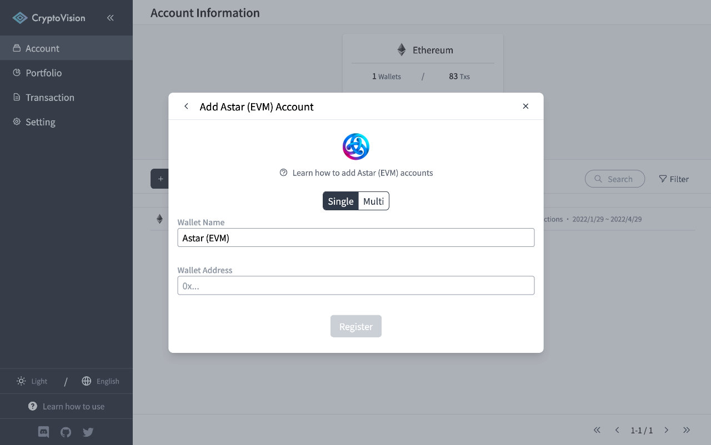
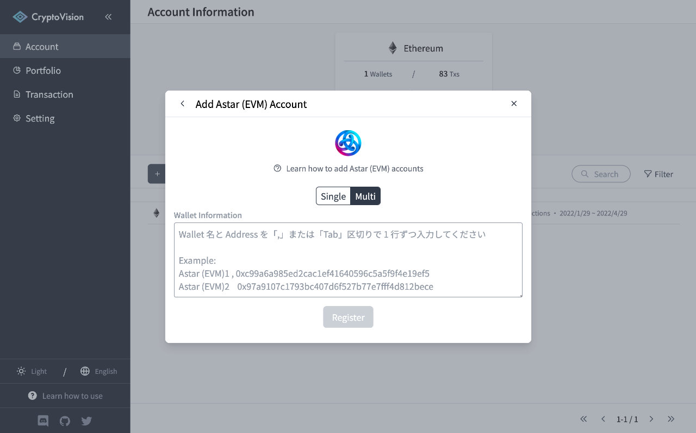

# How to add "Astar (EVM)" accounts

This page explains how to add an Astar (EVM) account to CryptoVision.

## Adding a Single Wallet

Enter your Astar (EVM) wallet address in the Wallet Address field.

After entering the information, click the "Register" button to complete account registration and begin retrieving and analyzing transactions.

## Adding Multiple Wallets at once

Enter the wallet name and address on one line in the Wallet Information field.

After entering the information, click the "Register" button to complete account registration and begin retrieving and analyzing transactions.

---

If you find any part of the explanations in this document that you feel is difficult to understand, please help us improve the document.
