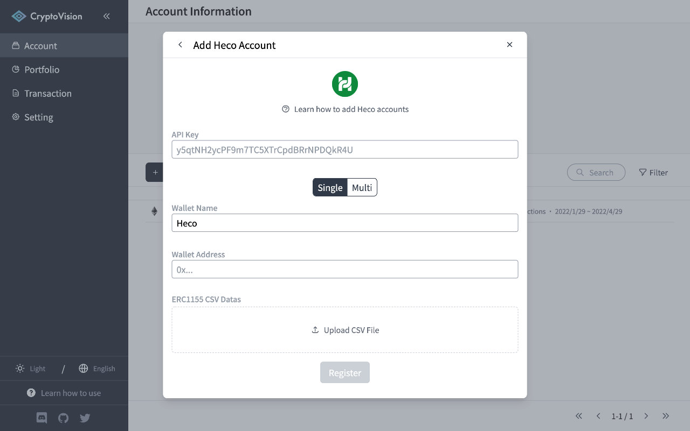
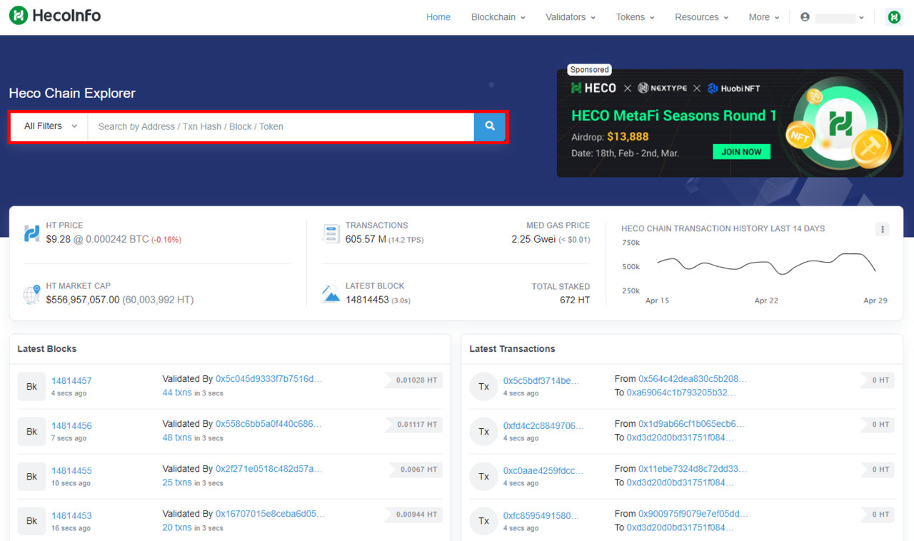
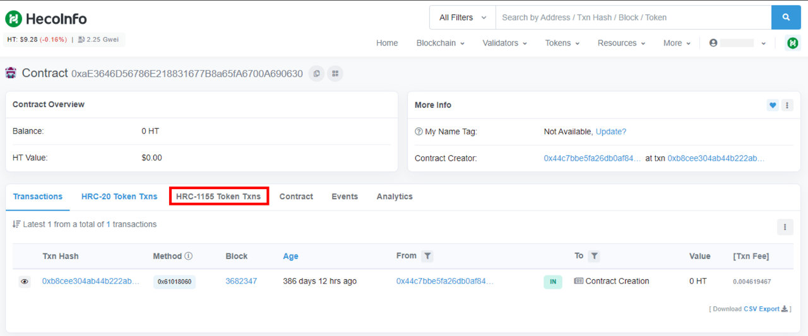
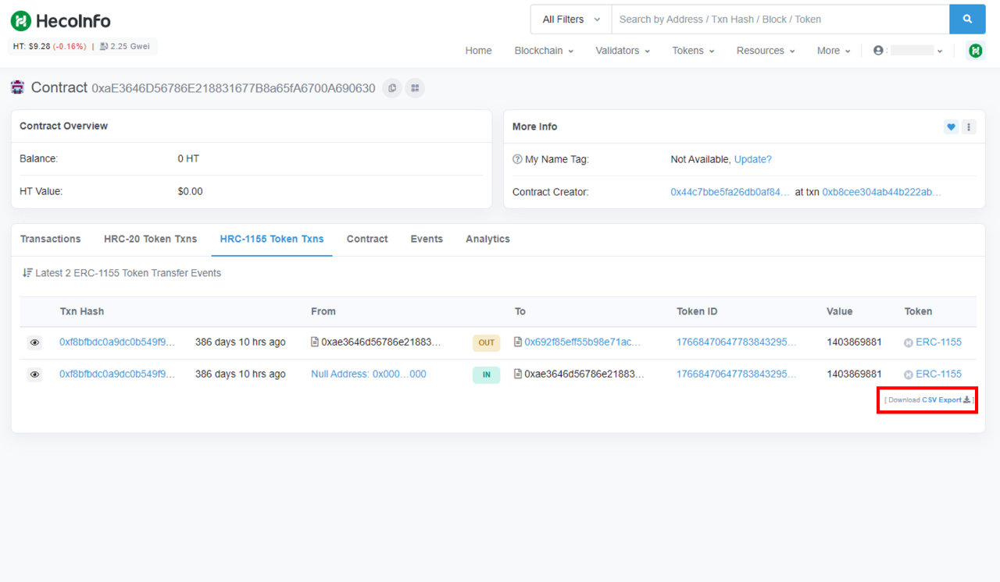
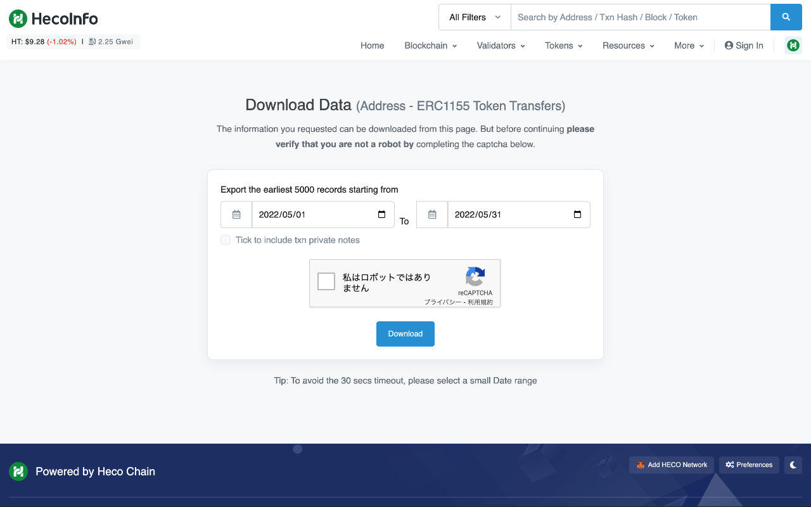
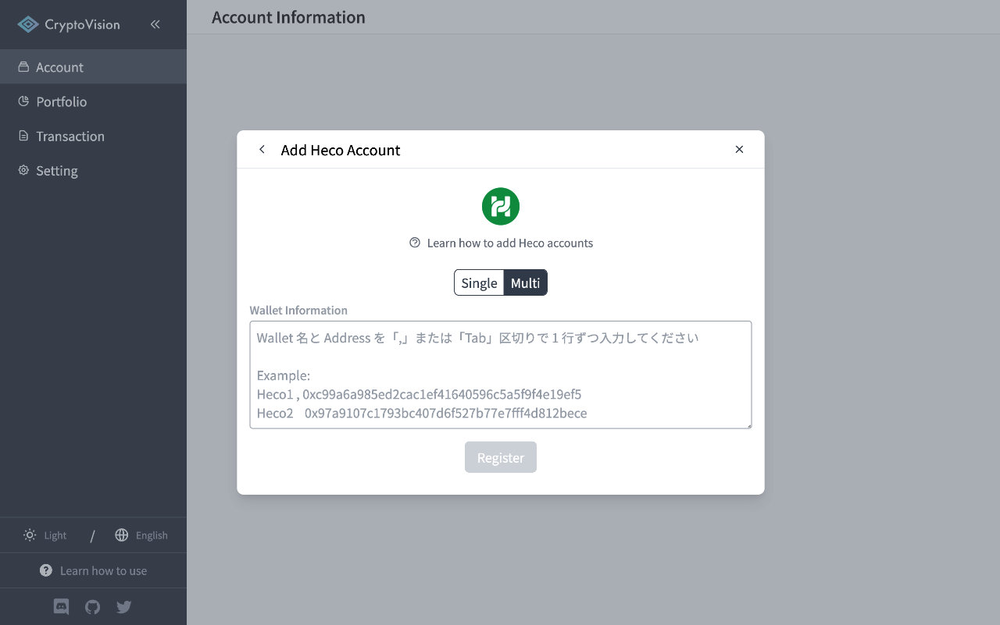

# How to add "Heco" accounts

This page explains how to add an HECO (Huobi ECO) account to CryptoVision.

### Adding a Single Wallet

Enter your HECO wallet address in the Wallet Address field.  
Upload the CSV file of the ERC 1155 Token Txns obtained by HecoInfo to the ERC1155 CSV Datas if necessary.

After entering the information, click the "Register" button to complete account registration and begin retrieving and analyzing transactions.

### How to get ERC1155 CSV Data

Go to HecoInfo ([hecoinfo.com](https://hecoinfo.com)) and enter and search for your wallet address.

Go to the "ERC1155 Token Txns" tab and click the "Download CSV Export" button.

Select the period for which you want to output the history as CSV, and click the "Download" button to download the CSV data.

### Adding Multiple Wallets at once

Enter the wallet name and address on one line in the Wallet Information field.

After entering the information, click the "Register" button to complete account registration and begin retrieving and analyzing transactions.

※ ERC1155 CSV Data cannot be registered for adding multiple wallets at once

---

If you find any part of the explanations in this document that you feel is difficult to understand, please help us improve the document.
