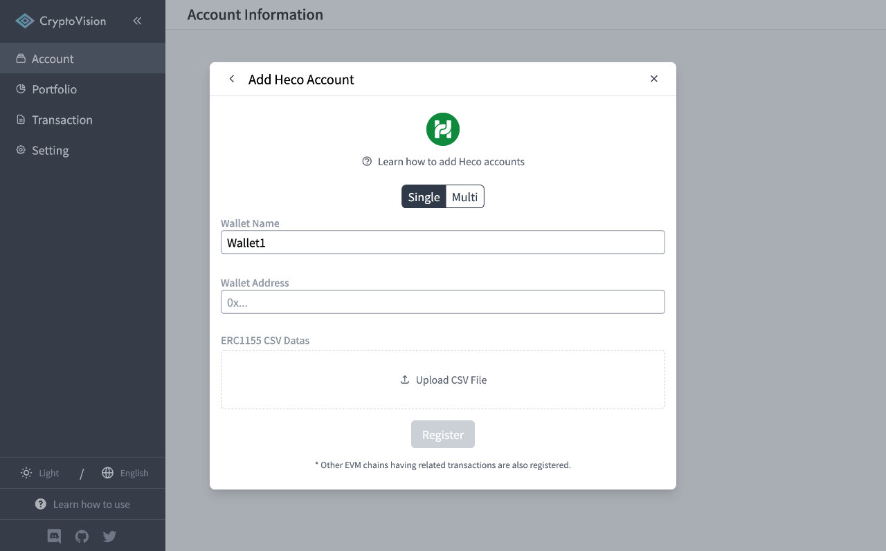

# How to add "Heco" accounts

This page explains how to add an HECO (Huobi ECO) account to CryptoVision.  
To add an HECO account, you will need an HecoInfo API Key, so I will also show you how to get one.

## How to get HecoInfo API Key

Go to HecoInfo ([hecoinfo.com](https://hecoinfo.com)) and click the "Sign In" button.

Enter your username and password to sign in.  
If you do not have an account, please click the "Click to sign up" button to create an account.

After signing in, click the "API Keys" button to go to the API Key management page.

If you do not have an API Key, click the "Add" button to open the Create New API Key modal, then click the "Create New API Key" button to create new API Key.

Once you have completed the creation of the API Key, copy it.

Do not delete the created API Key.

### Adding a Single Wallet

Enter the API Key obtained from HecoInfo in the API Key field.  
Enter your HECO wallet address in the Wallet Address field.  
Upload the CSV file of the ERC 1155 Token Txns obtained by HecoInfo to the ERC1155 CSV Datas if necessary.

After entering the information, click the "Register" button to complete account registration and begin retrieving and analyzing transactions.

### ERC1155 CSV Data の取得方法

Go to HecoInfo ([hecoinfo.com](https://hecoinfo.com)) and enter and search for your wallet address.

Go to the "ERC1155 Token Txns" tab and click the "Download CSV Export" button.

Select the period for which you want to output the history as CSV, and click the "Download" button to download the CSV data.

### Adding Multiple Wallets at once

Enter the API Key obtained from HecoInfo in the API Key field.  
Enter the wallet name and address on one line in the Wallet Information field.

After entering the information, click the "Register" button to complete account registration and begin retrieving and analyzing transactions.

※ ERC1155 CSV Data cannot be registered for adding multiple wallets at once

---

If you find any part of the explanations in this document that you feel is difficult to understand, please help us improve the document.
