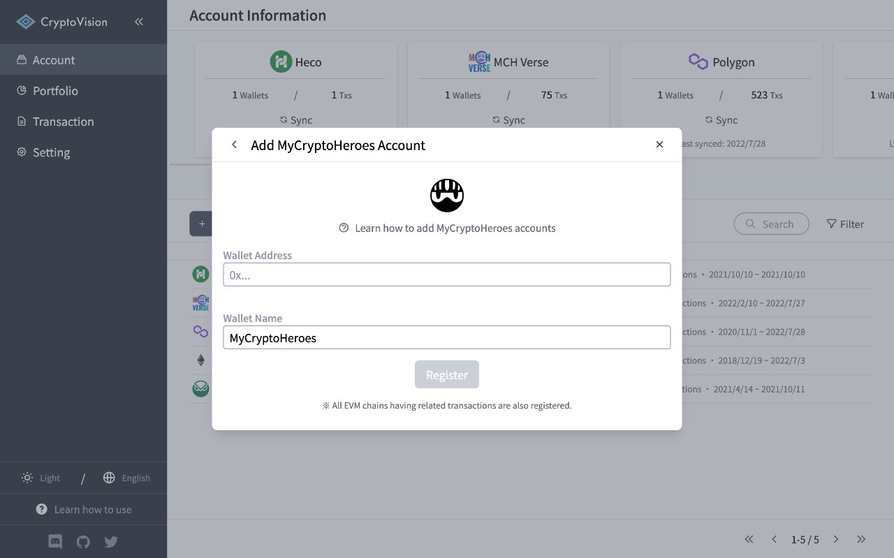

# How to add "MyCryptoHeroes" accounts

Enter your MyCryptoHeroes wallet address in the Wallet Address field.

After entering the information, click the "Register" button to complete account registration and begin retrieving and analyzing transactions.

※ Registering a MyCryptoHeroes account will register all EVM Chain accounts that have a Transaction associated with the entered address.

---

If you find any part of the explanations in this document that you feel is difficult to understand, please help us improve the document.
