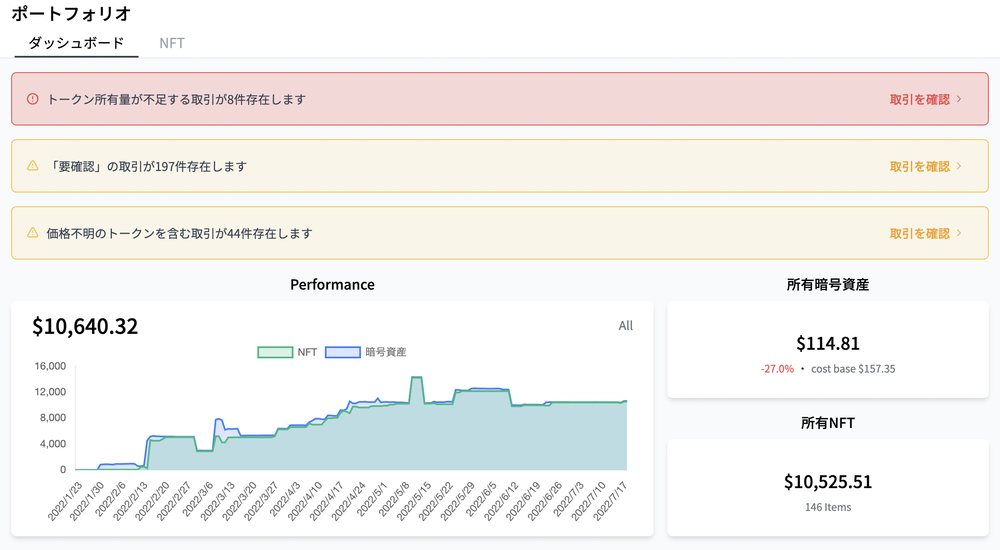
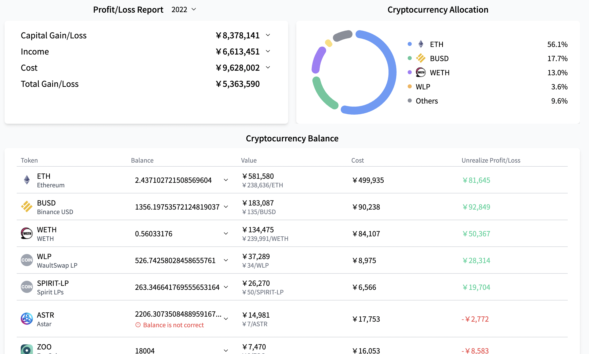
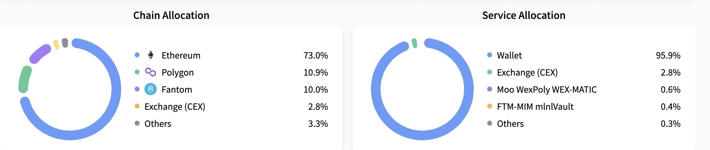
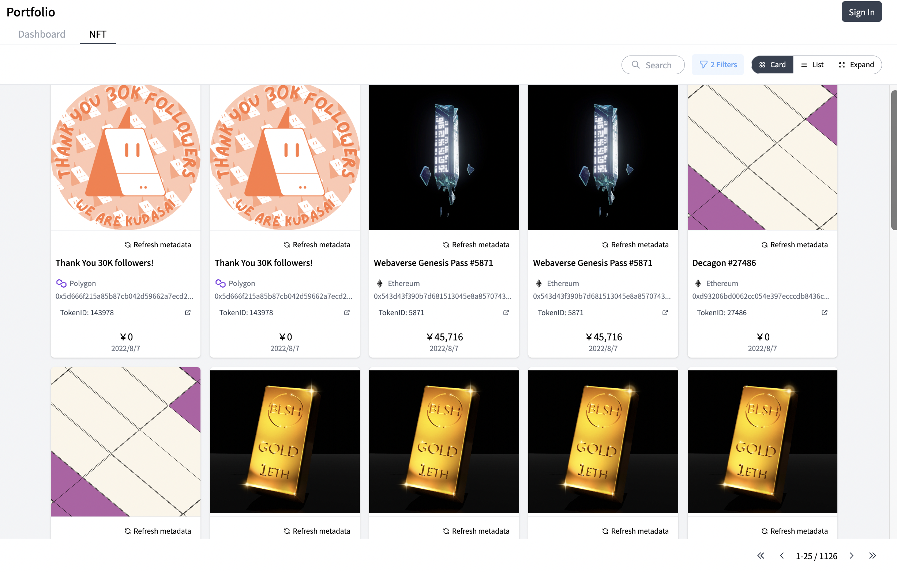
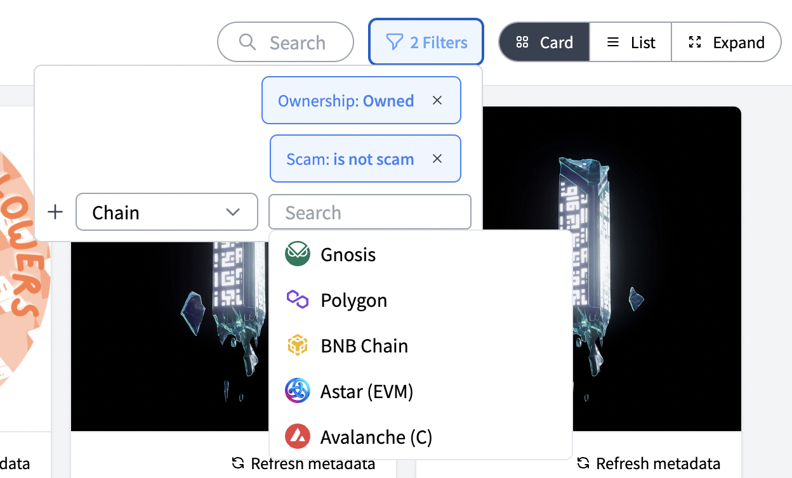
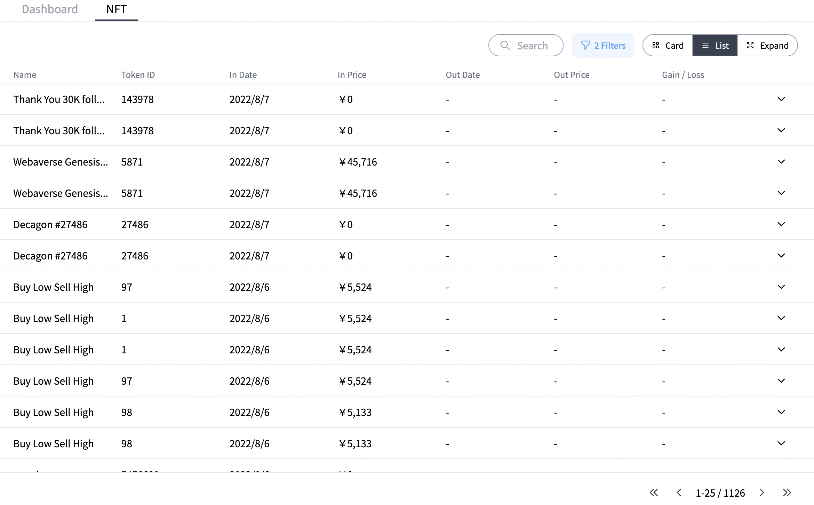
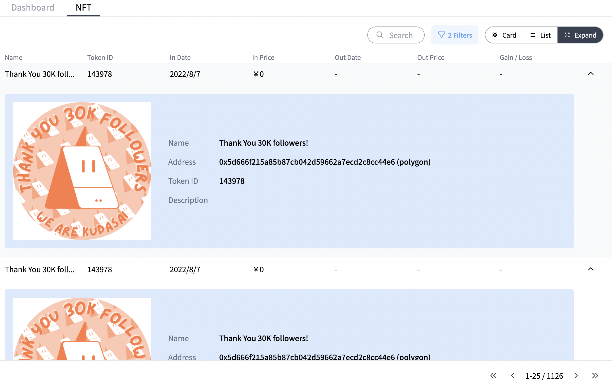

# Exploring PortFolio Dashboard

## Dashboard Tab

### Warnings at the top of the page

When you click the Dashboard tab, you will see several warnings, as shown in the picture above.

The "Insufficient Token Volume" shown in the red box is often due to not uploading the ERC-1155 CSV.

For information on how to upload a CSV of ERC-1155 on the Ethereum network , please refer to [How to add "Ethereum" accounts](./account-chain-ethereum.md) and for information on how to upload a CSV of ERC-1155 on the Polygon network, please refer to [How to add "Polygon" accounts](./account-chain-polygon.md).  

The "RequireCheck" area lists transactions that are classified with a high degree of certainty by CryptoVision's proprietary algorithm, but that require final confirmation by you (users). For more information on how to navigate through the transaction window, please refer to [Exploring Transaction List Page](./transaction-window.md).

The "Transactions involving tokens of unknown price" section lists transactions that involve tokens for which a token price could not be calculated at the time of the transaction and consequently you (users) will be asked to type in a token price. For more information on how to navigate through the transaction window, please refer to [Exploring Transaction List Page](./transaction-window.md).

### Target Date

For all items in the PortFolio Dashboard page, except for the "Profit/Loss Report", you can select the "Target Date" for the point in time you want to retrieve (by default, the date when you are accessing CryptoVision is selected).

### Performance
You will see a graph of the amount of NFTs and cryptocurrencies throughout the year up to the "Target date".

### Cryptocurrency Value / NFT Value

You will see the amount of cryptocurrencies and NFTs you possess as of the "Target Date".
The calculation method is as follows.  
**Cryptocurrencies** : current holdings multiplied by the market value. For the market value, we use the API of [Coingecko](https://www.coingecko.com/) for the price in legal tender (dollar, yen, euro, etc.).  
**NFT** : The total price of the owned NFT at the time of acquisition respectively(as it is the unique price for each NFT). In calculating the price at acquisition, we calculate the price in legal tender at the time of purchase (obtained from Coingecko's API, as with cryptocurrencies) for the cryptocurrency you paid for when you purchased the NFT.

### Profit/Loss Report

Capital Gain/Loss  shows the Gain/Loss from buying and selling cryptocurrecies and NFTs for the selected fiscal year.  
Income and Cost shows all other gains and losses (interest, staking fees, airdrops, transaction fees (gas fees), etc...).  
You can select the year you want to display from the drop-down above.

### Cryptocurrency Allocation
The percentage of each cryptocurrency in the total cryptocurrencies as of the "Target Date" is shown.

### Cryptocurrency Balance
The amount, value, the price at acquisition, and unrealized gains/losses of each cryptocurrency owned as of the "Target Date" are shown.

### Chain Allocation
The  percentage of total assets(cryptocurrencies and NFTs) as of the "Target Date" is shown as a percentage of total assets by chain.

### Service Allocation
The  percentage of total assets(cryptocurrencies and NFTs)as of the "Target Date" is shown as a percentage of total assets by service (DeFi protocols, games, wallets, and other applications).

## NFT tab

You will see a list of the NFTs you possess as of the "Target Date".

From the funnel symbol in the upper right corner, you can set filters for NFTs to be displayed by specifying conditions, such as by chain.

You can also set the display format from the tabs in the upper right corner, like

list format,

the format which displays details.

