# Understanding different transaction classifications

We recommend that you classify transactions on a regular basis so that you can use those data for various purposes,like calculating profit/loss and managing your own portfolio.

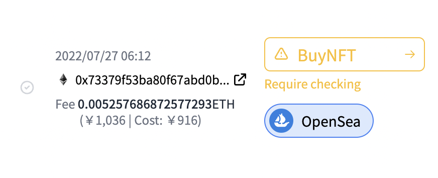

In order to properly classify each transaction, you have to have a grasp of what each transaction classification means. We recommend you read through this page for a detailed explanation of CryptoVision's transaction classifications.

## The structure of this page
First of all, a transaction consists of (up to)three types of tokens, which are **①Acquired tokens**, **②Lost tokens**, and **③Tokens paid as a fee**. (There is also a "moved token" only in the case of a "MoveBetweenWallets" transaction.)

And as for **③Tokens paid as a fee**, many of the transactions on the blockchain take gas fees, while transcations off the blockchain are commonly not charged gas fees. In other words, there are two factors that are unique to each transaction: **①Acquired tokens** and **②Lost tokens**.

Therefore, after explaining **What each classification means**, we will explain the profit/loss calculation for each of **①Acquired tokens**, **②Lost tokens**　(and **③Tokens paid as a fee** for "MoveBetweenWallets" transactions only) in the **Profit/Loss Calculation** section.

We will explain the **Profit/Loss Calculation** for each transaction category, but as mentioned above, many transactions on the blockchain have gas costs. From the **Profit/Loss Calculation** value explained for each transaction category, subtract the market value of the tokens consumed for gas as an expense, finally add the profit/loss for that gas token , which is "market value at time of transaction - acquisition price", and the result is the final profit/loss calculation result for that transaction.

## Transactions Classifications List

### Buy/Sell tokens

- [Swap](#Swap)
- [Buy](#Buy)
- [Sell](#Sell)

### Remittance
- [MoveBetweenWallets](#MoveBetweenWallets)
- [ReceiveFromCEX](#ReceiveFromCEX)
- [SendToCEX](#MoveBetweenWallets)

### Income
- [Airdrop](#Airdrop)
- [StakingReward](#StakingReward)
- [Interest](#Interest)
- [Mining](#Mining)
- [Income](#Income)

### Receive
- [Receive](#Receive)
- [Scam](#Scam)

### Payment
- [Pay](#Pay)

### Gift
- [Gift](#Gift)

### NFT

- [FreeMint](#FreeMint)
- [NFTMint](#NFTMint)
- [BuyNFT](#BuyNFT)
- [SellNFT](#SellNFT)
- [ReceiveNFT](#ReceiveNFT)
- [SendNFT](#SendNFT)
- [SwapNFT](#SwapNFT)

### Lend/Borrow ・ DeFi
- [AddPair](#AddPair)
- [RemovePair](#RemovePair)
- [Deposit](#Deposit)
- [Withdraw](#Withdraw)
- [Borrow](#Borrow)
- [BorrowBack](#BorrowBack)
- [Move（deprecated）](#Move（deprecated）)

### Transaction Execution
- [FailedExecution](#FailedExecution)
- [Approve](#Approve)
- [Revoke](#Revoke)
- [ContractExecution](#ContractExecution).

## Swap
  
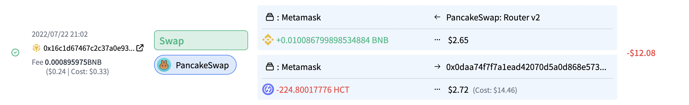

### What this classification means?

Transactions in which you exchange(buy and sell) tokens.

You can exchange any number of tokens in one transaction.

### Profit/Loss Calculation

#### ①Acquired tokens

Tokens acquired during the exchange(buying and selling) of tokens.  
Profit/Loss is not going to be calculated, but the token market value at the time of the transaction is going to be added to the acquisition price.

#### ②Lost tokens
Tokens lost during the exchange(buying and selling) of tokens. 
Profit/Loss is going to be calculated as "market value at the time of the transaction - acquisition price".

## Buy

<!-- TODO: insert screenshot. -->
<!--  -->

### What this classification means?
Transactions in which you purchase tokens(cryptocurrencies, NFTs) with legal tender (dollars, yen, euros, etc...).

### Profit/Loss Calculation

#### ①Acquired tokens

Profit/Loss is not going to be calculated, but the token market value at the time of the transaction is going to be added to the acquisition price.

#### ②Lost tokens

Cash paid to purchase tokens.  
Profit/Loss is not going to be calculated.

## Sell

<!-- TODO: insert squiggle  -->
<!--  -->

### What this classification means?
Transactions in which you sell tokens(cryptocurrencies, NFTs) and receive legal tender (dollars, yen, euros, etc...).

### Profit/Loss Calculation

#### ①Acquired tokens

Cash received.  
Profit/Loss is not going to be calculated.

#### ②Lost tokens

"Profit/loss on transaction" is going to be calculated as "market value at time of transaction - acquisition price".

## MoveBetweenWallets
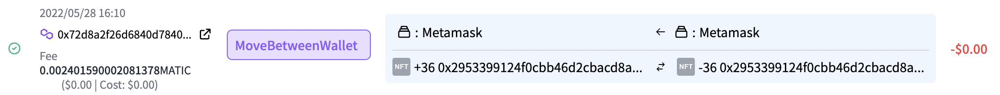

### What this classification means?

Transactions in which you transfer tokens(cryptocurrencies, NFTs) between wallets(addresses) you own.

### Profit/Loss Calculation

#### ①Acquired tokens

Not used for "MoveBetweenWallets".

#### ②Lost tokens

Not used for "MoveBetweenWallets".

#### ③Moved tokens (* Used only for "MoveBetweenWallets")

Tokens sent between wallets registered as accounts.  
Profit/Loss is not going to be calculated.

## SendToCEX

### What this classification means?

Transactions in which you transfer money from your address on the blockchain to your account on a (centralized) exchange.

### Profit/Loss Calculation

#### ①Acquired tokens
※ Not used for "SendToCEX".

#### ②Lost tokens
Tokens sent from the wallet to the exchange.  
Profit/Loss is not going to be calculated.

## ReceiveFromCEX

### What this classification means?

Transactions in which you transfer money from your account on a (centralized) exchange to your address on the blockchain.

### Profit/Loss Calculation

#### ①Acquired tokens
Tokens sent from the exchange to the wallet.  
Profit/Loss is not going to be calculated.

#### ②Lost tokens
※ Not used for "ReceiveFromCEX".  
    
※※If you have not uploaded all the transaction data from the exchange, you will end up transferring more than the amount of your assets onthe exchange to the address on the blockchain. In such cases, CryptoVision is going to process it as an insufficient amount owned error, and all tokens for the missing amount are going to be treated as having been purchased for free.

## Airdrop

<!--  -->

### What this classification means?

Transactions in which you receive free tokens.

### Profit/Loss Calculation

#### ①Acquired tokens

Tokens received as "Airdrop".  
The token market value at the time of the transaction is going to be calculated as "Airdrop (income)".  
The token market value at the time of the transaction is going to be added to the acquisition price.

#### ②Lost tokens

※ Not used for "Airdrop".

## StakingReward

### What this classification means?
Tokens earned by holding specific tokens or staking (depositing) tokens to a specific address.

### Profit/Loss Calculation

#### ①Acquired tokens

Tokens received as "StakingRewards".  
The token market value at the time of the transaction is going to be calculated as "Interest/Staking Reward (income)".  
The token market value at the time of the transaction is going to be added to the acquisition price.

#### ②Lost tokens

Not used for "StakingRewards".

## Interest
<!--  -->

### What this classification means?

Interest earned from token lending, etc.

### Profit/Loss Calculation

#### ①Acquired tokens
Tokens received as "Interest".  
The token market value at the time of the transaction is going to be calculated as "Interest/Staking Reward (income)".  
The token market value at the time of the transaction is going to be added to the acquisition price.

#### ②Lost tokens
* Not used for "Interest".

## Mining

<!-- TODO: スクショ挿入 -->
<!--  -->

### What this classification means?

Transactions in which you earn tokens as a reward for mining (one way of verifying and approving blockchain transactions).

### Profit/Loss Calculation

#### ①Acquired tokens

Tokens received as "Mining".  
The token market value at the time of the transaction is going to be calculated as "Interest/Staking Reward (income)".  
The token market value at the time of the transaction is going to be added to the acquisition price.

#### ②Lost tokens
* Not used for "Mining".

## Income
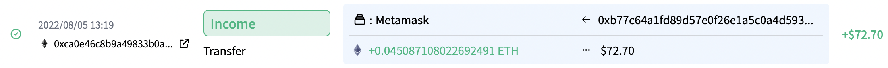 

### What this classification means?

Transactions in which you receive tokens as income (profit) (without payment) other than "Airdrop," "StakingReward," or "Interest," such as in-game rewards in blockchain games.

### Profit/Loss Calculation

#### ①Acquired tokens

Tokens you acquired.  
 
The token market value at the time of the transaction is going to be calculated as "income".  
The token market value at the time of the transaction is going to be added to the acquisition price.

#### ②Lost tokens

* Not used for "Income".

## Receive

### What this classification means?

Transactions in which you receive tokens (without payment)that are not income (profit).

### Profit/Loss Calculation

#### ①Acquired tokens

Tokens you received.  

Profit/Loss is not going to be calculated, but the token market value at the time of the transaction is going to be added to the acquisition price.

#### ②Lost tokens

Not used for "Receive".

## Scam
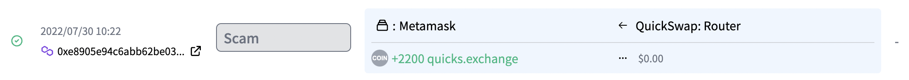

### What this classification means?

Transactions in which　unrecognized/suspicious tokens are suddenly sent to you.

### Profit/Loss Calculation

#### ①Acquired tokens

Tokens sent to you.  
Profit/Loss is not going to be calculated, and its price is not going to be 　added to the acquisition price.

#### ②Lost tokens

Not used for "Scam".

## Pay
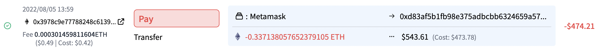

### What this classification means?
Transactions in which you send cryptocurrencies to another address and the payment is going to be recorded as an expense in terms of the tax code.

### Profit/Loss Calculation

#### ①Acquired tokens

Not used for "Pay".

#### ②Lost tokens

The cryptocurrencies you paid are going to be lost, and the "market value at the time of transaction - acquisition price" is going to be calculated as the "Profit/Loss on transaction".  
The market value at the time of the transaction is going to be calculated as "cost".

## Gift

### What this classification means?

Transactions in which you send cryptocurrencies  to another address and the payment is going to be recorded as an expense in terms of the tax code.

### Profit/Loss Calculation

#### ①Acquired tokens

Not used in "transfers".

#### ②Lost tokens

You lose the tokens that you gave and the "Profit/Loss" is going to be calculated as "market value at the time of the transaction - acquisition price".

## FreeMint

### What this classification means?

Transactions in which you issue(mint) NFTs for free.

### Profit/Loss Calculation

#### ①Acquired tokens

NFTs issued.  
Profit/Loss is not going to be calculated. 
Since the market value at the time of issuance is 0, it is going to be added to the acquisition price as value 0.

#### ②Lost tokens

Not used for "FreeMint".

## NFTMint

### What this classification means?

Transactions in which you issue(mint) NFTs for free.

### Profit/Loss Calculation

#### ①Acquired tokens
NFTs issued.  
Profit/Loss is not going to be calculated, but the token market value at the time of the transaction is going to be added to the acquisition price.

#### ②Lost tokens

Croptocurrencies you paid for the NFTs issued (minted).  
The "market value at the time of the transaction - acquisition price" is going to be calculated as the "Profit/Loss on Transaction".

## BuyNFT

### What this classification means?

Transactions in which you purchase NFTs paying cryptocurrencies.

### Profit/Loss Calculation

#### ①Acquired tokens

The NFT purchased.  
Profit/Loss is not going to be calculated, but the token market value at the time of the transaction is going to be added to the acquisition price.

#### ②Lost tokens

Croptocurrencies you paid for the NFTs bought.  
The "market value at the time of the transaction - acquisition price" is going to be calculated as the "Profit/Loss on Transaction".

## SellNFT

### What this classification means?

Transactions in which you sell NFTs and obtain cryptocurrencies.

### Profit/Loss Calculation

#### ①Acquired tokens

CryptoCurrencies obtained in return for the NFTs you sold.
Profit/Loss is not going to be calculated, but the token market value at the time of the transaction is going to be added to the acquisition price.

#### ②Lost tokens

NFTs you sold.  
The "Profit/Loss" is calculated as "market value at the time of the transaction - acquisition price".

## ReceiveNFT

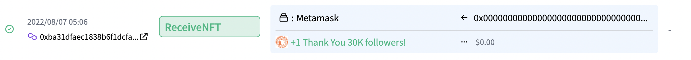

### What this classification means?

Transactions in which you receive NFTs from others (e.g. Airdrops, Giveaways, etc....).

### Profit/Loss Calculation

#### ①Acquired tokens

NFTs received. The market value at the time of receive is going to be added to the acquisition price.

#### ②Lost tokens

Not used for "ReceiveNFT".

## SendNFT

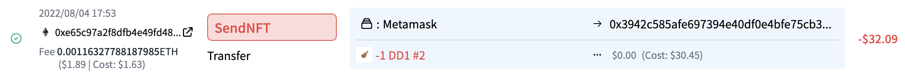

### What this classification means?

Transactions in which you send NFTs to another addresses for free.

### Profit/Loss Calculation

#### ①Acquired tokens

Not used for "SendNFT".

#### ②Lost tokens

Sent Tokens .  
Profit/Loss is not going to be calculated.

## SwapNFT

### What this classification means?

Transactions in which the token itself is replaced, although of the same value(e.g. when the NFT contract address changes) .

### Profit/Loss Calculation

#### ①Acquired tokens

The NFT you received.  
The acquisition price of the NFT lost is going to be  added to the acquisition price of the NFT received.

#### ②Lost tokens

NFTs you originally held that you sent to the address for exchange.  
Since the acquisition price is transferred to ①, Profit/Loss is not going to be calculated.

## AddPair

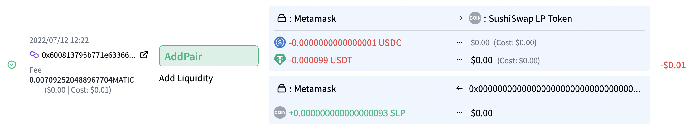

### What this classification means?

A number of DEXs (decentralized exchanges), such as Uniswap, provide a mechanism to exchange different tokens by creating Liquidity Pools(LP).  
CryptoVision classifies transactions in which you provide multiple tokens in LP as "ddPair".

### Profit/Loss Calculation

#### ①Acquired tokens

So-called "LP tokens" that are granted for an LP offering.  
Profit/Loss is not going to be calculated, but the market value of the token at the time of the transaction is going to be added to the acquisition price.

#### ②Lost tokens

Tokens deposited at the address for the LP offering.  
The "market value at the time of the transaction - acquisition price" is going to be calculated as the "Profit/Loss on the transaction".

## RemovePair

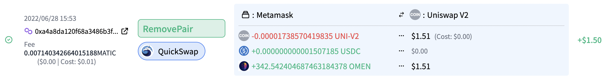

### What this classification means?

Transactioms in which you withdraw the tokens deposited in the "AddPair" above (and return the LP tokens at the same time).

### Profit/Loss Calculation

#### ①Acquired tokens

Tokens withdrawn from an address for LP provision.  
Profit/Loss is not going to be calculated, but the market value of the token at the time of the transaction is going to be added to the acquisition price.

#### ②Lost tokens

So-called "LP tokens" that were granted for an LP offering.  
The "market value at the time of the transaction - acquisition price" is going to be calculated as the "Profit/Loss on Transaction".

## Deposit
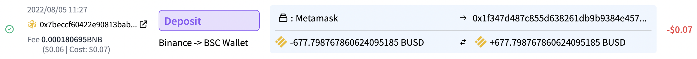

### What this classification means?

Transactions in which you deposit tokens to another address.

### Profit and Loss Calculation

#### ①Acquired tokens

For some deposit, you are going to acquire some tokens(e.g., credit tokens) and for other deposits, you are not. 
Profit/Loss is not going to be calculated, but the market value of the token at the time of the transaction (if you acquire tokens)is added to the acquisition price.

#### ②Lost tokens
Deposited tokens.

## Withdraw

### What this classification means?

Transactions in which you withdraw tokens from the address where those were deposited.

### Profit and Loss Calculation

#### ①Acquired tokens

Tokens that have been withdrawn.  
Profit/Loss is not going to be calculated.

#### ②Lost tokens

You may or may not have to return tokens (lose or doesn't lose) (e.g. credit tokens).  
IF you lose those tokens, the "Profit/Loss" is calculated as the "market value at the time of the transaction - acquisition price".

## Borrow

<!--  -->

### What this classification means?

Transactions in which you borrow tokens from another address.

### Profit and Loss Calculation

#### ①Acquired tokens

Borrowed tokens.  
Profit/Loss is not going to be calculated, but the market value of the token at the time of the transaction is going to be added to the acquisition price.

#### ②Lost tokens

If you deposit other tokens as collateral for the borrowing, the token is going to be lost. If you not deposit, no token are going to be lost.  
Profit/Loss is not calculated in any cases.

## BorrowBack

<!--  -->

### What this classification means?

Transactions in which you return tokens borrowed from another address.

### Profit and Loss Calculation

#### ①Acquired tokens

If you deposited tokens as collateral,you'll acquire the tokens ; if not, there is no token you'll acquire.  
Profit/Loss is not going to be calculated in any cases.

#### ②Lost tokens

Tokens to repay.  
The "market value at the time of the transaction - acquisition price" is going to be calculated as "Profit/Loss on transaction".

## Move (deprecated)

### What this classification means?

A "Move" transaction that does not fall into any of the categories of "Deposit," "Withdraw", "Borrow" or "BorrowBack"  
CrptoVision's algorithm automatically classify the transaction into the appropriate of the above 4 categories.

### Profit and Loss Calculation

Profit/Loss is going to be calculated according to the four automatically classified transaction classification types.

## FailedExecution

<!--  -->

### What this classification means?

Transactions that failed to execute.  
Since no token transfer happens, Profit/Loss is not going to be calculated (except for gas costs).

## Approve

<!--  -->

### What this classification means?

Transactions in which you give permission to a third party address (mainly a contract address such as DeFi) to move tokens in your wallet.  
Since no token transfer happens, Profit/Loss is not going to be calculated (except for gas costs).

## Revoke

<!--  -->

### What this classification means?

This transaction removes permission to move tokens in your wallet that you had given to a third party address (mainly a contract address such as DeFi).  
Since no token transfer happens, Profit/Loss is not going to be calculated (except for gas costs).

## ContractExecution

<!--  -->
### What this classification means?

Transactions in which no transfer of tokens associated with your wallet happens.  
Since no token transfer happens, Profit/Loss is not going to be calculated (except for gas costs).

