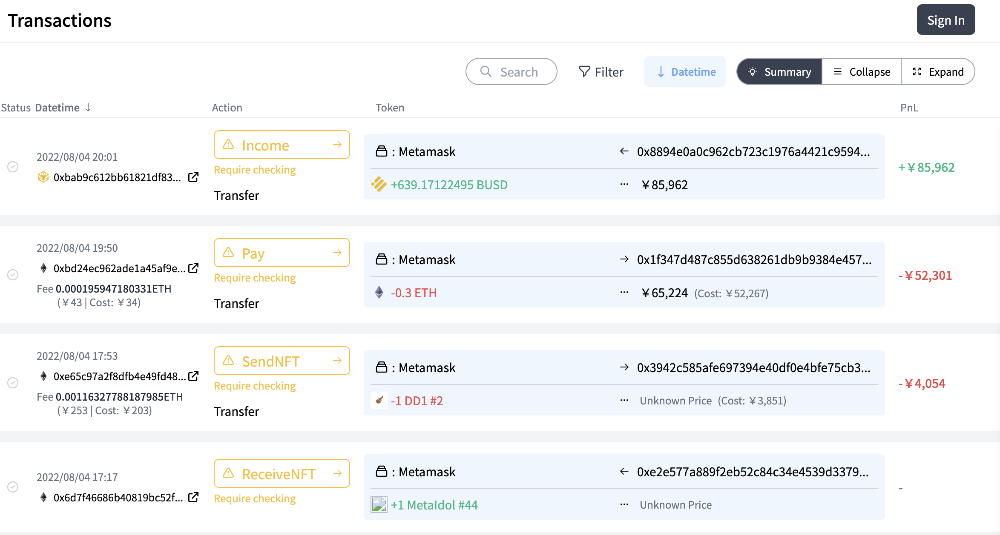
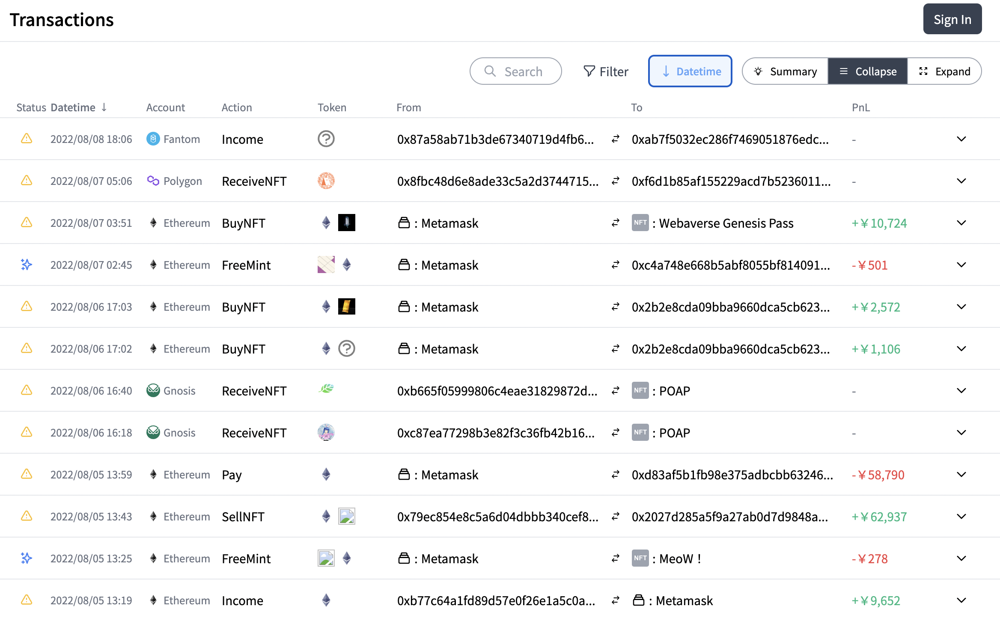
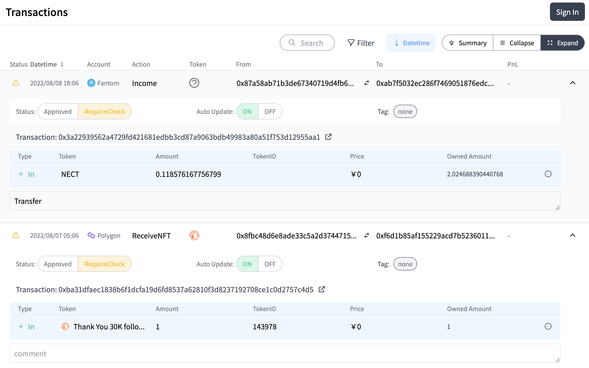
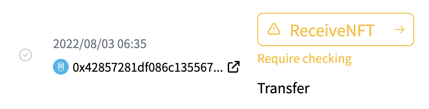
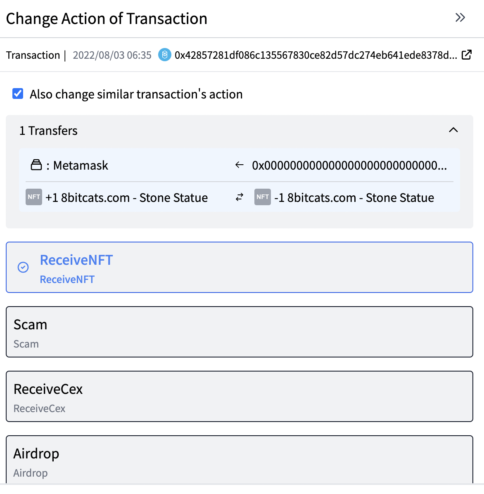

# Exploring the Transaction Page

## Exploring the Transaction Page

You will see a list of transactions of the address you have registered.  

You can sort the list in ascending or descending order by pressing the "Datetime" button in the upper right corner of the window. By default, the list is sorted in descending order.

You can also get a list of transactions in list format by pressing the "Collapse" tab in the upper right corner,

and you can also get a list of the details of each transaction by pressing the "Expand" tab.

## Classify Transactions

We recommend that you journalize transactions on a regular basis for the purpose of calculating taxes to be paid at the end of the fiscal year and for your own portfolio management.

### Approval status of transactions
Transactions are classified into four categories based on their approval status.

#### ①Confirmation Required  

 

"Confirmation Required" transactions are transactions that CryptoVision's proprietary algorithm has classified with a high degree of certainty, but that **you(users) need to confirm.** It is indicated by Yellow color.**If the transaction classification is correct, click the small check mark to the left.**  

Then it will turn green, as shown below.  

**If the transaction classification is improper or you are not sure if it is correct, click on the transaction classification ("Receive NFT" in the above figure)**.

Then a pop-up will appear from the right, as shown below, and click on the appropriate journal entry.

What each transaction classification means is explained in [Understanding the different transaction classifications](./transaction-journal.md).

#### ②Highly Accurate

"Highly Accurate" transactions are transactions that you do not need to confirm because CryptoVision's proprietary algorithm has classified it with a sufficiently high degree of accuracy.
They are marked in green.
**You don't need to do anything with this one.**

#### ③Confirmed

As shown in the figure posted under "①Confirmation Required," when a transaction requiring confirmation is "confirmed," the status becomes "confirmed" and turns green.

#### ④Rules

If you change the classification of other transactions with "Also change similar transaction's action" on, similar transactions will be classified as the same classification with high accuracy. In this case, the approval status will be "Rule", which is similar to "Highly Accurate".
The display format will be purple as shown above.
