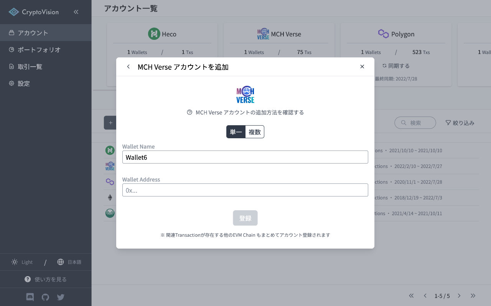
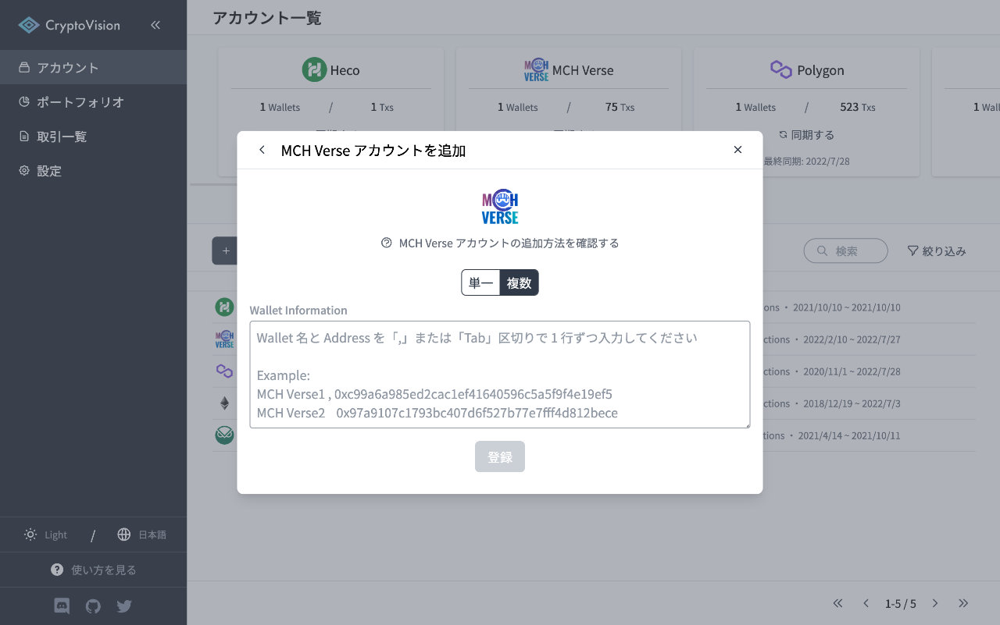

# MCH Verse アカウントの追加方法

このページでは CryptoVision に MCH Verse アカウントを追加する方法を説明します。

## 単一ウォレットを追加する場合

Wallet Address にはあなたの MCH Verse ウォレットのアドレスを入力してください。

入力後、「登録」ボタンをクリックするとアカウントの登録が完了し、トランザクションの取得・解析が開始されます。

## 複数ウォレットを一括追加する場合

Wallet Information の欄にウォレット名とアドレスを１行ずつ入力します。

入力後、「登録」ボタンをクリックするとアカウントの登録が完了し、トランザクションの取得・解析が開始されます。

---

このドキュメントの解説の中でわかりにくいと感じたい部分がありましたら、是非ドキュメントの改善にご協力ください。
