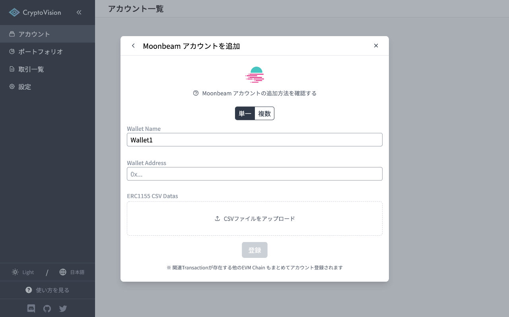
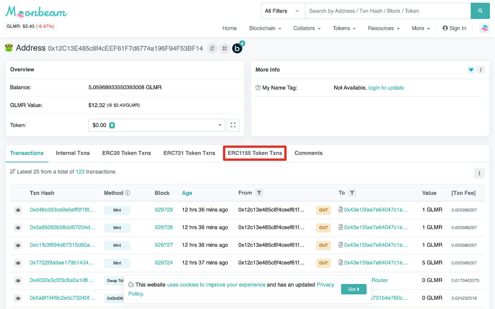
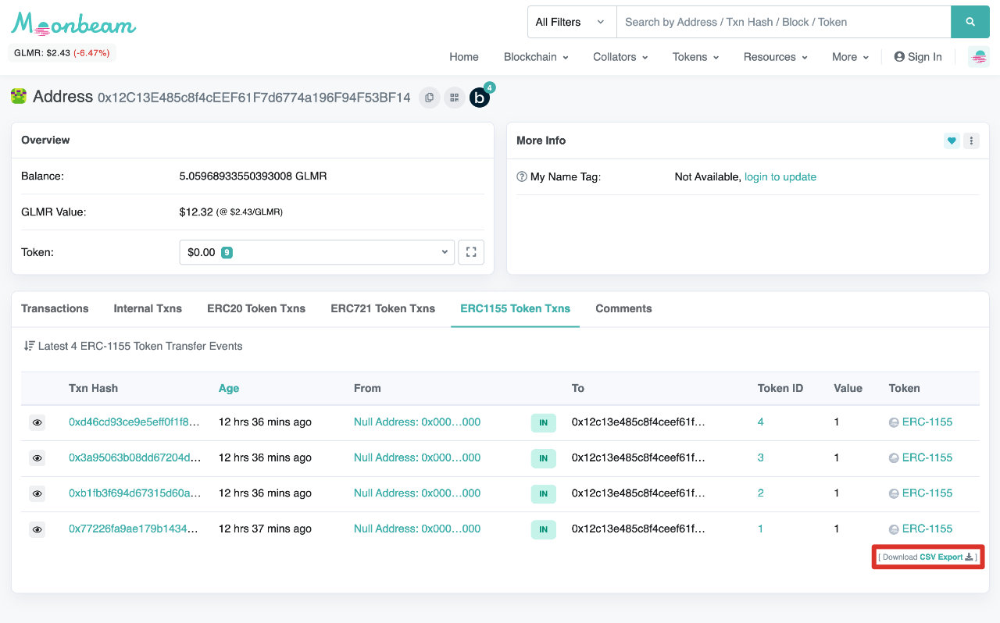
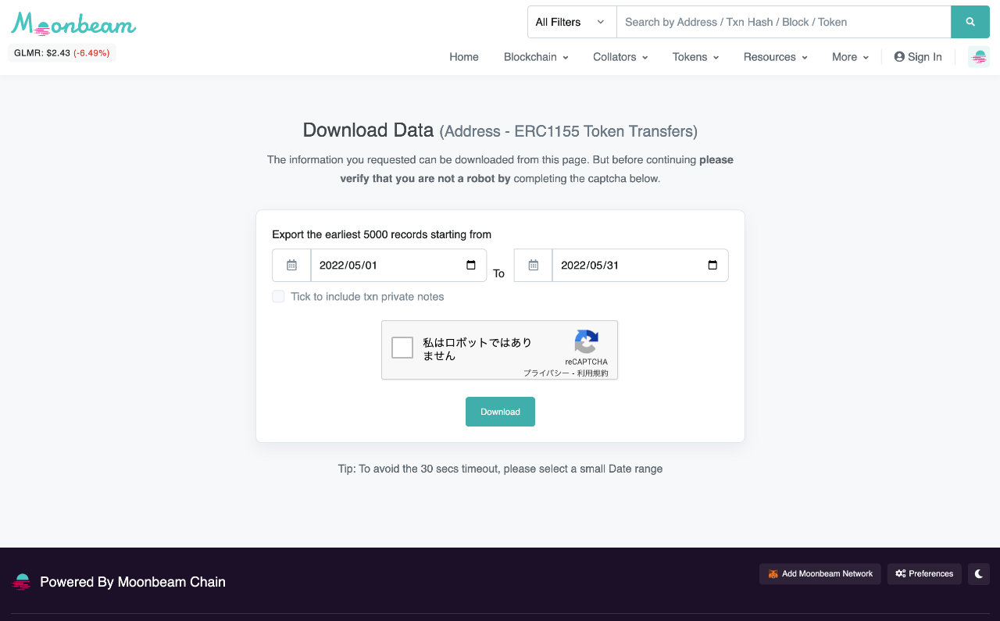
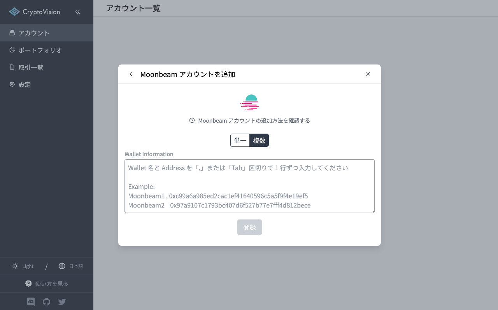

# Moonbeam アカウントの追加方法

このページでは CryptoVision に Moonbeam アカウントを追加する方法を説明します。

## Moonbeam アカウントの登録

### 単一ウォレットを追加する場合

Wallet Address にはあなたの Moonbeam ウォレットのアドレスを入力してください。  
ERC1155 CSV Datas には Moonbeam Chain Explorer で取得した ERC 1155 Token Txns の CSV ファイルを必要であればアップロードしてください。

入力後、「登録」ボタンをクリックするとアカウントの登録が完了し、トランザクションの取得・解析が開始されます。

### ERC1155 CSV Data の取得方法

Moonbeam Chain Explorer ([moonscan.io](https://moonscan.io)) にアクセスし、あなたのウォレットアドレスを入力・検索します。

「ERC1155 Token Txns」タブに移動し、「Download CSV Export」ボタンをクリックします。

CSV として履歴を出力したい期間を選択し、「Download」ボタンをクリックして CSV データをダウンロードします。

### 複数ウォレットを一括追加する場合

Wallet Information の欄にウォレット名とアドレスを１行ずつ入力します。

入力後、「登録」ボタンをクリックするとアカウントの登録が完了し、トランザクションの取得・解析が開始されます。

※ 複数ウォレット一括追加では ERC1155 CSV Data を登録することができません

---

このドキュメントの解説の中でわかりにくいと感じたい部分がありましたら、是非ドキュメントの改善にご協力ください。
