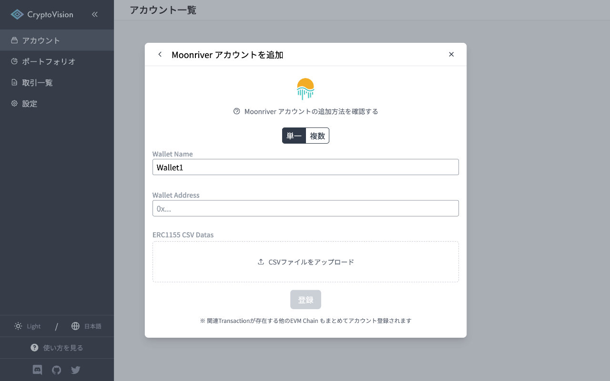

# Moonriver アカウントの追加方法

このページでは CryptoVision に Moonriver アカウントを追加する方法を説明します。  
Moonriver アカウントを追加するには Moonriver Chain Explorer API Key が必要になるので、その取得方法も解説します。

## Moonriver Chain Explorer API Key の取得方法

Moonriver Chain Explorer ([moonriver.moonscan.io](https://moonriver.moonscan.io)) にアクセスし、「Sign In」ボタンをクリックします。

Username と Password を入力してログインします。  
※ アカウントがない場合は「Click to sign up」ボタンを押してアカウントを作成してください。

ログインしたら「API Keys」ボタンを押して API Key の管理ページに移動します。

API Key がない場合は「Add」ボタンをクリックして新しい API Key の作成モーダルを開き、「Create New API Key」ボタンをクリックして API Key を作成します。

API Key の作成に完了したらコピーしてください。

※ 作成した API Key は削除しないでください

## Moonriver アカウントの登録

### 単一ウォレットを追加する場合

API Key の欄に Moonriver Chain Explorer で取得した API Key を入力します。  
Wallet Address にはあなたの Moonriver ウォレットのアドレスを入力してください。  
ERC1155 CSV Datas には Moonriver Chain Explorer で取得した ERC 1155 Token Txns の CSV ファイルを必要であればアップロードしてください。

入力後、「登録」ボタンをクリックするとアカウントの登録が完了し、トランザクションの取得・解析が開始されます。

### ERC1155 CSV Data の取得方法

Moonriver Chain Explorer ([moonriver.moonscan.io](https://moonriver.moonscan.io)) にアクセスし、あなたのウォレットアドレスを入力・検索します。

「ERC1155 Token Txns」タブに移動し、「Download CSV Export」ボタンをクリックします。

CSV として履歴を出力したい期間を選択し、「Download」ボタンをクリックして CSV データをダウンロードします。

### 複数ウォレットを一括追加する場合

API Key の欄に Moonriver Chain Explorer で取得した API Key を入力します。  
Wallet Information の欄にウォレット名とアドレスを１行ずつ入力します。

入力後、「登録」ボタンをクリックするとアカウントの登録が完了し、トランザクションの取得・解析が開始されます。

※ 複数ウォレット一括追加では ERC1155 CSV Data を登録することができません

---

このドキュメントの解説の中でわかりにくいと感じたい部分がありましたら、是非ドキュメントの改善にご協力ください。
