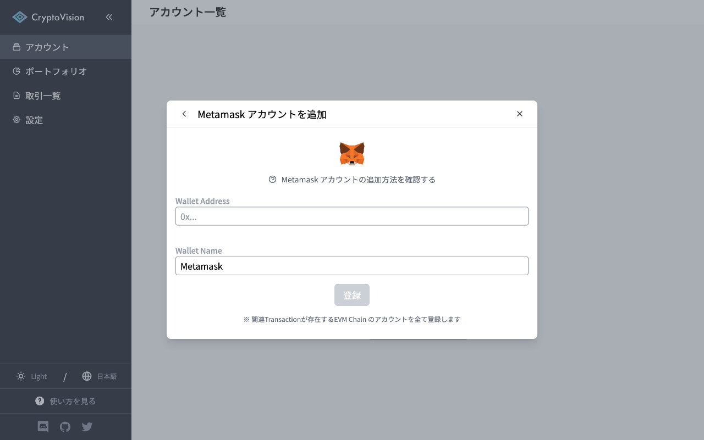

# Metamask アカウントの追加方法

Wallet Address にはあなたの  Metamask のウォレットアドレスを入力してください。

入力後、「登録」ボタンをクリックするとアカウントの登録が完了し、トランザクションの取得・解析が開始されます。

※ Metamask アカウントを登録すると、 address に関連する Transaction が存在する全ての EVM Chain のアカウントが登録されます

---

このドキュメントの解説の中でわかりにくいと感じたい部分がありましたら、是非ドキュメントの改善にご協力ください。
