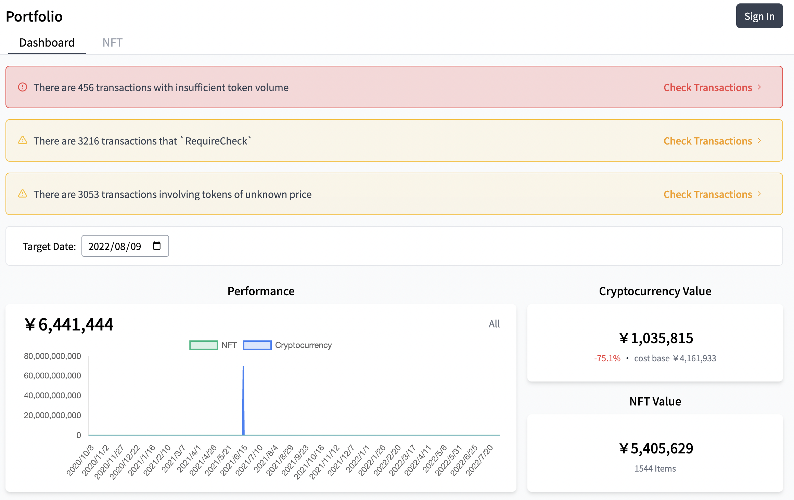
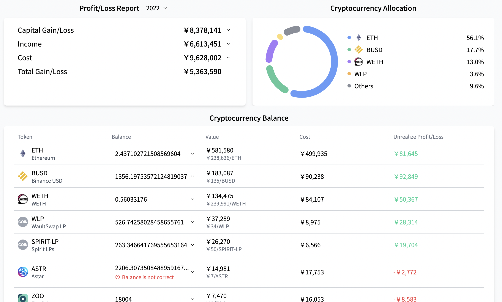
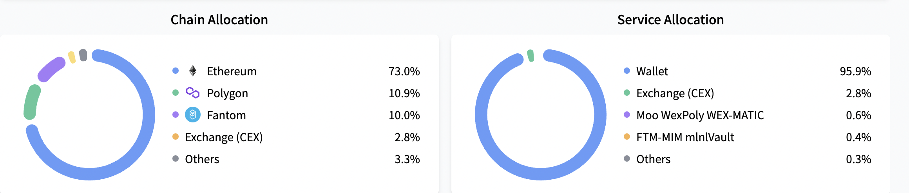

# ポートフォリオ画面の見方

## ダッシュボードタブ

### 上部の警告

ダッシュボードタブを開くと、下の画面のように、警告がいくつか出る場合があります。

赤枠で表示されている「トークン所有量の不足」については、ERC-1155のCSVをアップロードしていないことによるものが多いです。

EthereumネットワークでのERC-1155のCSVのアップロード方法については[イーサリアム（Ethereum）アカウントの追加方法](./account-chain-ethereum.md)を、PolygonネットワークでのERC-1155のCSVのアップロード方法については[Polygon アカウントの追加方法](./account-chain-polygon.md)を参照してください。

 

「要確認」のところは、CryptoVision独自のアルゴリズムで、ある程度高い確度で取引分類がなされているものの、あなた(ユーザー)に最終的な確認を要する取引が並べられています。取引画面の見方については[取引画面の見方](./transaction-window.md) を参照してください。

「価格不明のトークンを含む取引」のところは、取引時のトークン価格が算定できなかったトークンを含む取引で、あなた(ユーザー)にトークン価格を入力してもらう必要がある取引が並べられています。取引画面の見方については[取引画面の見方](./transaction-window.md) を参照してください。

### パフォーマンス

1年を通じた、NFTと暗号資産額の推移のグラフをご確認いただけます。

### 所有暗号資産・所有NFT

現時点での暗号資産とNFTの所持額をご確認いただけます。
計算方法は以下の通りです。 
 
 
**暗号資産** : 現在の所有量に時価を掛けた価格。時価に関して、法定通貨(ドル、円、ユーロなど)建ての価格は[Coingecko](https://www.coingecko.com/)のAPIを使用しています。  
**NFT** : 所有NFTの取得時の価格の総額(NFTごとの固有価格になるため)。取得時の価格に関して、購入した時に支払った暗号資産の、購入時点での法定通貨建の価格(暗号資産と同じくCoingeckoのAPIから取得)を算出しています。

### 損益概要

取引損益は、暗号資産やNFTの売買による損益(キャピタルゲイン)を表示しています。  
収入や費用は、それ以外の全ての損益(利息やStaking報酬、エアドロップ、取引手数料(ガス代)など)を表示しています。

### 暗号資産比率
暗号資産全体の中での、各暗号資産の割合を表示しています。

### 暗号資産所有状況
各暗号資産の所有量と、現在・取得時の価格、含み損益を表示しています。

### チェーン別資産比率

暗号資産、NFT合わせたトータルの資産額について、チェーン別の資産比率を表示しています。

### サービス別資産比率

暗号資産、NFT合わせたトータルの資産額について、サービス(DeFiプロトコル・ゲームやウォレットなどのアプリケーション)別の資産比率を表示しています。

