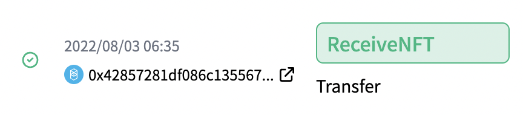

# 取引画面の見方

## 画面全体の見方

<!-- TODO: 背景グレーになってないスクショに差し替え -->

登録したアドレスの取引一覧が見られる画面です。

<!-- TODO: ソートUIがが切れていないスクショに差し替え -->

右上にある、「Datetime」のところを押すと、昇順か降順かでソートすることができます。デフォルトでは降順でソートされています。

<!-- TODO: 背景グレーになってないスクショに差し替え -->

また右上の「リスト」タブを押すとリスト形式で取引一覧を取得することができ、

「詳細」タブを押すと、各取引の詳細の一覧を表示することができます。

## 取引を分類する

年度末に払う税金の計算のためや、ご自身のポートフォリオ管理のため、取引は定期的に仕訳することをお勧めします。

### 取引の承認状態について
取引は、その承認状態に基づいて4つに分類されます。

#### ①要確認

「要確認」とは、CryptoVision独自のアルゴリズムである程度高い確度で分類したものの、**あなた(ユーザー)が確認する必要がある取引です。**
黄色で表示されます。
**取引分類が合っていれば、左にある小さなチェックマークをクリックしましょう。**
そうすると下のように緑に変わります。

<!-- TODO: 背景グレーになってないスクショに差し替え -->

**取引分類が間違っている、あるいは合っているかわからないときは,取引内容(上の図の場合は「NFT所得」)をクリックしましょう**

そうすると、以下のようにポップアップが右から現れるので、該当する仕訳をクリックしましょう。

各取引の意味については、[取引分類の意味を理解する](./transaction-journal.md)　で説明しています。

#### ②高精度

<!-- TODO: 背景グレーになってないスクショに差し替え -->

「高精度」とは、CryptoVision独自のアルゴリズムで十分に高い確度で分類したので、あなたが確認する必要のない取引です。
緑色で表示されます。
**こちらについては特に処理する必要はありません。**

ちなみに、上の図のように、「Opensea」の取引など、アルゴリズムで解析できたものについて詳細情報を記載する場合があります。

#### ③確認済

<!-- TODO: 背景グレーになってないスクショに差し替え -->

①「要確認」にも掲載した図ですが、要確認の取引を「確認」すると、「確認済」のステータスになり、緑色になります。

#### ④ルール

他の取引の分類を変更した時に「類似取引も同様に変更」をONの状態で変更すると、類似の取引も同じ分類として高精度に分類されます。この場合の承認ステータスは「ルール」となり、「高精度」と似たステータスになります。
表示形式は、上記のように紫色になります。
