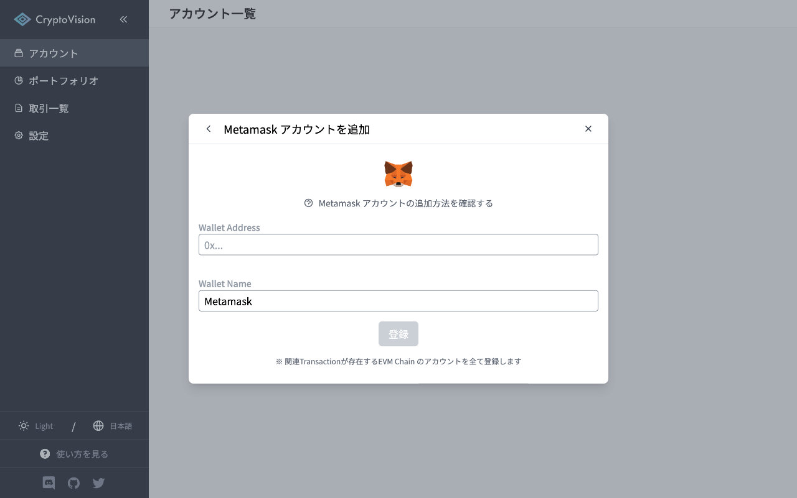

# 2022/07/27 アップデート情報

## 取引一覧画面の刷新

取引一覧画面をより見やすく、編集しやすいデザインに変更しました。  
標準状態ではこの新しいデザインで取引一覧は表示されます。

### 詳細表示

新UIでは詳細を開かなくても取引内容が一目でわかるように改良されていますが、更に詳しく見たい場合は該当取引をクリックすることで詳細を表示できます。

### 取引（分類）の編集

CryptoVision では取引分類の自動解析を行いますが、全ての取引を完璧に解析することは難しく、ユーザー側で確認・編集が推奨される取引も存在します。  
この確認・編集が必要な取引の確認作業が、取引分類のボタンをクリック後、表示される取引分類の候補から選択するだけで完了するようになりました。

また編集した取引分類は、類似取引にも自動的に適用されます。

### 以前のUI

以前のUIも表示モードを、デフォルトの「サマリー」から「リスト」に切り替えることで今まで通り利用できます。

## ダッシュボード画面の刷新

ポートフォリオ > ダッシュボード画面も新しくなりました。  
グラフ表示機能を強化し、これまでの保有資産の推移グラフ・暗号資産別・チェーン別・サービス別の資産比率等のグラフを追加ました。  
また、現在のポートフォリオだけでなく、過去の指定日のポートフォリオも確認できるようになりました。

### 過去のポートフォリオ確認

対象日を変更することで、指定した日付のポートフォリオを確認することができます。  
損益計算結果を除く全ての情報が対象日のものに更新されます。

### アドレスごとの保有資産確認

暗号資産所有状況の各トークンの数量をクリックすると、ウォレットアドレスごとの（計算上の）所有量及びブロックチェーンで記録されている実際の所有量を確認することができます。その二つがずれていた場合に、「所有量」のところに表示されているのは、「計算上の所有量」です。

## EVM チェーンアカウントの一括登録

EVMチェーンの（ウォレット）アカウントは、1度アドレスを入力するだけで全てのEVMチェーンのアカウントを登録できるようになりました。  
また今まで必要だった API Key の入力も不要になっています。

## Solana NFT 対応

EVM互換のチェーンのNFTだけでなく、 Solana の NFT の解析及び metadata（画像等）の取得も可能になりました。

## Contributor 版を統合

Contributor 版を統合し、Contributor ログイン機能を追加しました。  
画面右上の「ログイン」ボタンをクリックしてContributor として登録したメールアドレス・パスワードを入力することで Contributor アカウントとして制限なしの機能を利用できます。

Contributor になりたい方はDiscordに参加し、Contributor への Apply Form を提出してください。

[Discord への参加はこちら](https://discord.gg/D3F5C3yZaC)

