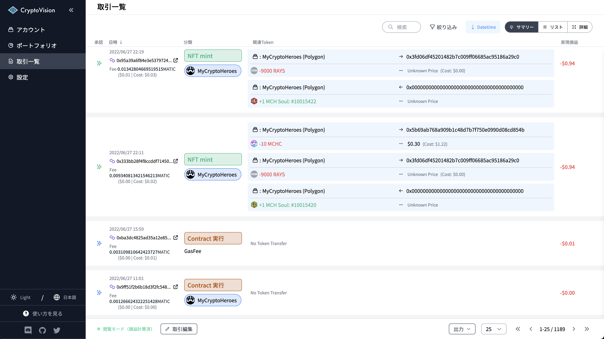
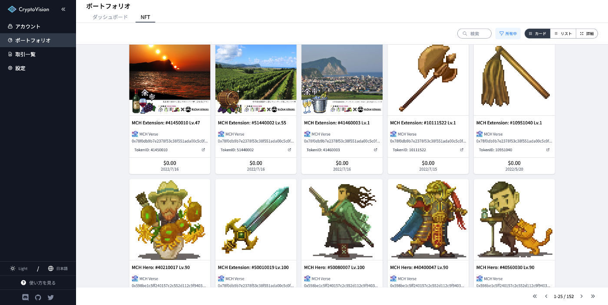

# 2022/07/28 アップデート情報

## My Cropto Heroes 及び MCH Verse Chain に対応

2017年から運営を続ける、日本初のブロックチェーンゲーム「My Crypto Heroes」に対応しました。  
アカウント追加時に「My Crypto Heroes」を選択することで簡単にウォレットを登録することができます。

My Crypto Heroes アカウントの追加方法は[こちらの記事](../guide/account-service-mycryptoheroes.md)を確認ください。

また、 My Crypto Heroes が運営する Oasys Layer2 のブロックチェーン「MCH Verse」へも対応しました。

## ダッシュボード画面の改善

ダッシュボード画面の各資産比率グラフで、所有量・時価が 0 の項目を表示しないように修正しました。

## バグの修正

いくつかのバグを修正しました。
